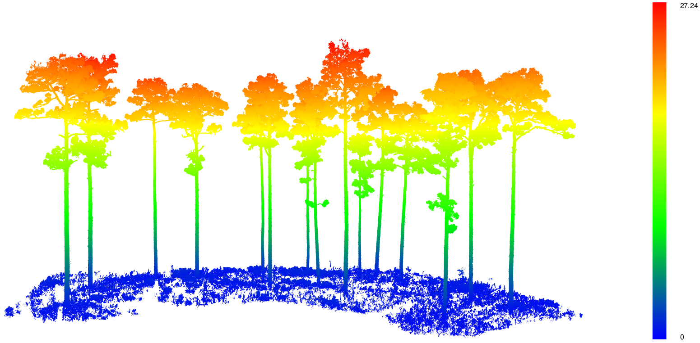
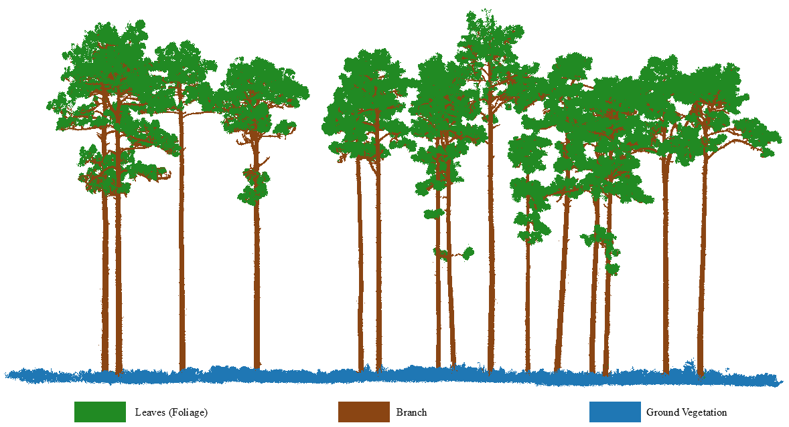

<p align="center">
  
</p>

<!-- This is a comment. [](https://github.com/venkatasivanaga/FuelDeep3D/actions/workflows/rhub.yaml)  --> 

[](https://github.com/venkatasivanaga/FuelDeep3D/actions/workflows/r.yml)
[](https://cran.r-project.org/package=FuelDeep3D)


[](https://app.travis-ci.com/venkatasivanaga/FuelDeep3D)

<!-- This is a comment. [](https://venkatasivanaga.r-universe.dev/FuelDeep3D)  --> 

# FuelDeep3D: An R package for Fire Fuels Segmentation in 3D Using Terrestrial Laser Scanning and Deep Learning  

**Authors:** Venkata Siva Reddy Naga, Alexander John Gaskins, and Carlos Alberto Silva.


`FuelDeep3D` provides tools for processing, feature extraction, and classification of 3D forest point clouds for fuel assessment applications. 
The package supports creating training datasets, computing height-derived metrics, segmenting vegetation structures, and writing per-point fuel 
classes back to LAS/LAZ files. These functions streamline TLS-based fuel mapping workflows and enable integration with forest inventory, 
wildfire modeling, and ecological analysis pipelines in R.  

The package enables users to move efficiently from raw .las files to classified fuel layers, supporting applications in forest structure assessment, wildfire behavior modeling, and fuel complexity analysis.

FuelDeep3D offers tools to:

- Build structured training datasets from labeled point clouds
- Compute height-derived features such as height-above-ground (HAG)
- Tile, sample, and preprocess large TLS scenes for efficient modeling
- Apply trained models to new .las files and write predictions back to disk
- Enable users to train their own deep learning models on custom labeled datasets
- Perform visualization, quality control, and evaluation of predicted fuel classes


---

## 1. Getting Started

### 1.1 Installation of the FuelDeep3D package


```r
install.packages(
  "FuelDeep3D",
  repos = c("https://venkatasivanaga.r-universe.dev/FuelDeep3D",
            "https://cloud.r-project.org")
)

library(FuelDeep3D)

```

---

### 1.1.1 Manual installation using Anaconda/Miniconda (Only if not already installed)

**i) Download**

- Anaconda (full distribution, includes many packages):  
  <https://www.anaconda.com/download>

OR
  
- Miniconda (lightweight, only Conda + Python):  
  <https://docs.conda.io/en/latest/miniconda.html>

**ii) Install**

1. Download the Windows installer (**64-bit**) for Python 3.x.
2. Run the installer:
   - Accept the license.
   - Choose **“Just Me”** (recommended) unless you know you need “All Users”.
   - Keep the default install location (e.g., `C:\Users\<you>\anaconda3`).
   - *Optional but convenient:* check **“Add Anaconda to my PATH”** if you want
     to use `conda` from a normal Command Prompt.
3. Click **Next - Install** and wait for the installation to finish.
4. Open **Anaconda Prompt** from the Start menu and run:

   ```bash
   conda --version

### 1.1.2 Create the `pointnext` Conda environment 

You can create the Python environment directly from R using **reticulate** and install all Python dependencies.

```r
# 0) Install FuelDeep3D and reticulate if not already
install.packages("FuelDeep3D")    # from r-universe or other repo
install.packages("reticulate")

library(FuelDeep3D)
library(reticulate)

# 1) Create or reuse the "pointnext" env and install deps if needed
ensure_py_env("pointnext")   # creates env + installs deps the first time
# ensure_py_env("pointnext", reinstall = TRUE)  # force reinstall if you want

# 2) Sanity check – should show Python from the "pointnext" env
py_config()

```

> **Note (Troubleshooting):** If you run into any Conda/reticulate issues while creating or activating the `pointnext` environment (e.g., R picks the wrong Python, `py_config()` shows an unexpected interpreter, or you see missing-module/DLL errors), refer to the **[Conda + R (reticulate) Troubleshooting Guide](inst/readme/conda_reticulate_troubleshooting.md)** for step-by-step diagnostics and fixes.

---

## 2. Visualization of a 3D point cloud

`FuelDeep3D` integrates smoothly with the **lidR** package, enabling users to quickly explore
LiDAR scenes, height structures, and model-predicted segmentations.  
This section provides simple commands to visualize `.las` / `.laz` files during your workflow.

---

### 2.1 Visualize LiDAR data by Height (Z)

This visualization shows the unclassified LiDAR point cloudwith points colored by height (Z value).
This height-based coloring helps reveal canopy layers, trunk structure, and differences in ground elevation.

```r
library(lidR)

las <- readLAS(system.file("extdata", "las", "trees.laz",
                           package = "FuelDeep3D"))

# las <- readLAS("path/to/your_file.laz")

# 1) Default plot (black bg, legend on, thickness by height)

plot_3d(las)

# 2) Custom palette + white background

plot_3d(
  las,
  bg = "white",
  height_palette = c("purple","blue","cyan","yellow","red"),
  title = "Custom palette"
)
  
# 3) Fixed Z color scale for comparisons + no legend

plot_3d(
  las,
  zlim = c(0, 40),
  add_legend = FALSE,
  title = "Fixed Z (0-40), no legend"
)
  
# 4) Turn OFF thickness-by-height; use a single point size

plot_3d(
  las,
  size_by_height = FALSE,
  size = 4,
  title = "Uniform thicker points"
)
  
# 5) Legend on the LEFT and thicker legend bar

plot_3d(
  las,
  legend_side = "left",
  legend_width_frac = 0.05,
  title = "Legend left"
)
  
# 6) Make everything thicker (multiplies size_range when size_by_height=TRUE)

plot_3d(
  las,
  size = 1.8,
  size_range = c(1, 7),
  size_power = 1.2,
  title = "Thicker points by height"
)

```

<p align="center">
  
</p>

This view helps inspect canopy structure, terrain variation, and overall point-cloud quality.

---

## 3. Predict on new data using a pre-trained model

```r
library(FuelDeep3D)
library(reticulate)
use_condaenv("pointnext", required = TRUE)

cfg <- config(
  las_path     = system.file("extdata", "las", "trees.laz", package = "FuelDeep3D"),  # any LAS or LAZ you want to segment
  out_pred_dir = "output_predictions",
  model_path   = system.file("extdata", "model", "best_model.pth", package = "FuelDeep3D"),       # your pre-trained checkpoint
  num_classes = 3
)

predict(cfg, mode = "overwrite", setup_env = FALSE)
# or keep original classification and add 'pred_label':
# predict(cfg, mode = "extra", setup_env = FALSE)
```

## 3.1 Predicted Result

### Visualizing predicted classes in R

FuelDeep3D stores per-point predictions in the LAS attribute **`Classification`** (the standard LAS classification field).
You can visualize these predictions directly in R using an interactive **rgl** window with `predicted_plot3d()`.
Points are colored by any discrete field stored in `las@data` (e.g., `"Classification"` for predictions or `"label"` for original labels).

> Note: FuelDeep3D intentionally does **not** draw a fixed legend inside the rgl window.
> Instead, when `verbose = TRUE`, the function prints a clear **class → name → color** mapping in the R console.

#### Predicted output (Classification)

```r
library(lidR)
library(FuelDeep3D)

# Read the predicted LAS/LAZ (predictions stored in las@data$Classification)
las_pred <- readLAS("trees_predicted.las")

predicted_plot3d(
  las_pred,
  field = "Classification",
  bg    = "white",
  title = "Predicted classes (Classification)",
  verbose = TRUE
)
```

#### Compare raw labels vs predicted classes.

```r
las_raw <- readLAS("trees.las")

# Original labels (ground truth) stored in las@data$label
predicted_plot3d(las_raw, field = "label", bg = "white", title = "Original labels")

# Predicted labels stored in las@data$Classification
predicted_plot3d(las_pred, field = "Classification", bg = "white", title = "Predicted classes")
```

#### Custom colors and custom class names

```r
my_cols <- c(
  "0" = "#1F77B4",  # blue
  "1" = "#8B4513",  # brown
  "2" = "#228B22"   # green
)

my_labs <- c(
  "0" = "Ground vegetation",
  "1" = "Branch/Stem",
  "2" = "Leaves/Foliage"
)

predicted_plot3d(
  las_pred,
  field = "Classification",
  class_colors = my_cols,
  class_labels = my_labs,
  bg = "white",
  verbose = TRUE
)
```

#### Downsampling (optional for large point clouds): The default setting plots every point (downsample = "none"). For large point clouds, use downsampling to speed up plotting and maintain responsiveness.

```r
predicted_plot3d(
  las_pred,
  field = "Classification",
  downsample = "voxel",
  voxel_size = 0.10,
  size = 2,
  bg = "white"
)
```
### Important note about color names

Base R does not recognize some CSS color names (for example, `lime`).  
To avoid errors, **hex codes** are recommended, though **valid base R color names** also work.

```r
# ✅ hex is safest
predicted_plot3d(las_pred, field="Classification",
                  class_colors = c("black","red","#00FF00"))

# ✅ valid base R name example: "limegreen"
predicted_plot3d(las_pred, field="Classification",
                  class_colors = c("black","red","limegreen"))
```



An example of the vegetation segmentation applied to a labeled LAS file.
Each point is colored by its predicted class (e.g., ground/understory, stem, canopy foliage).

<p align="center">
  
</p>

In this example, the model was trained on `trees.las` and then used to predict labels for the
same scene. The output LAS (`trees_predicted.las`) stores predictions in the `Classification`
field, which can be visualized in tools like CloudCompare or QGIS using a class-based color ramp.

---

## 4. Pre-processing and Training

Pre-processing prepares raw TLS point clouds for deep learning–based fuel
segmentation. This step focuses on removing obvious outliers, standardizing
point attributes, and improving the quality of model inputs prior to tiling
and feature extraction.

---

### 4.1 Optional noise filtering

TLS point clouds may contain isolated outlier points, particularly in sparse
regions of the scene. To reduce the influence of these points, FuelDeep3D
provides a utility function based on Statistical Outlier Removal (SOR).

The filtering is applied selectively to points above a user-defined height
threshold, while points below this threshold are preserved. This helps remove
sparse artifacts without affecting ground or lower vegetation structure.

**Parameters:**
- `height_thresh`: height (in meters) above which SOR is applied
- `k`: number of nearest neighbors used to estimate local point spacing
- `zscore`: standard deviation multiplier controlling outlier rejection

#### Example: apply noise filtering

```r
library(FuelDeep3D)
library(lidR)

# Load TLS point cloud
las <- readLAS(system.file("extdata", "las", "trees.laz",
                           package = "FuelDeep3D"))

# Apply SOR-based filtering
las_clean <- remove_noise_sor(
  las,
  height_thresh = 5,
  k = 20,
  zscore = 2.5
)

# Inspect the filtered point cloud
plot(las_clean, color = "Z", pal = height.colors(30), bg = "white")
```

### 4.2 Train a new model on your own labelled LAS data


```r
library(FuelDeep3D)
library(reticulate)
use_condaenv("pointnext", required = TRUE)

cfg <- config(
  las_path     = system.file("extdata", "las", "trees.laz", package = "FuelDeep3D"),
  out_dir      = system.file("extdata", "npz_files", package = "FuelDeep3D"),
  out_pred_dir = system.file("extdata", "output_directory", package = "FuelDeep3D"),
  model_path   = system.file("extdata", "model", "best_model.pth", package = "FuelDeep3D"),
  epochs       = 2, batch_size = 16,
  learning_rate = 1e-5, weight_decay = 1e-4,
  block_size = 6, stride = 1, sample_n = 4096,
  repeat_per_tile = 4, min_pts_tile = 512,
  cell_size = 0.25, quantile = 0.05
)

res <- train(cfg, setup_env = FALSE)        # trains & saves best .pth
predict(cfg, mode = "overwrite", setup_env = FALSE)  # writes trees_predicted.las
```

---

## 5. Evaluation of Predicted LAS Files

You can compute accuracy, confusion matrix, precision, recall, and F1 directly.

FuelDeep3D includes evaluation utilities to measure segmentation quality using LAS/LAZ files. These tools compute:

- Overall accuracy  
- Confusion matrix  
- Per-class precision, recall, and F1-score  

---

  ### 5.1.1 Evaluate Performance on a Single LAS File

  This function allows users to evaluate segmentation performance directly from a single LAS file that contains both ground-truth labels and predicted classes.
  Simply specify which attribute stores the true labels (e.g., "label") and which stores the predictions (e.g., "Classification"), and the function computes accuracy, confusion matrix, precision, recall, and F1 scores automatically.

  Use this when **ground truth and predictions are in the same LAS file**, stored in two different fields.

  - **Ground truth labels** (e.g., column `"label"`)
  - **Predicted classes** (e.g., column `"Classification"`)

  ```r
  library(FuelDeep3D)
  library(lidR)

  # LAS contains both GT (label) and predictions (Classification)
  las <- readLAS("trees_predicted.las")

  results <- evaluate_single_las(
    las,
    truth_col = "label",
    pred_col  = "Classification"
  )
  results$accuracy
  results$confusion_matrix
  results$precision
  results$recall
  results$f1

  ```

 ---

  ### 5.1.2 Evaluate Performance on Two LAS Files

  Use this when ground truth labels and predicted classes are in separate LAS/LAZ files.
  Both files must be point-wise aligned (same points in the same order, same number of points).
  The function compares truth_col vs pred_col and returns accuracy, confusion matrix, and per-class precision/recall/F1.


  ```r
  library(FuelDeep3D)
  library(lidR)

  truth_las <- readLAS("trees_groundtruth.las")  # contains truth_col (e.g., label)
  pred_las  <- readLAS("trees_predicted.las")    # contains pred_col  (e.g., Classification)

  results <- evaluate_two_las(
    truth_las,
    pred_las,
    truth_col = "label",
    pred_col  = "Classification"
  )

  results$accuracy
  results$confusion_matrix
  results$precision
  results$recall
  results$f1

  ```

  ---

  This helps to return a list with:

  - `confusion` – confusion matrix  
  - `accuracy` – overall accuracy  
  - `precision` – per-class precision  
  - `recall` – per-class recall  
  - `f1` – per-class F1 scores  

  ---


  ### 5.2 Print Confusion Matrix

  ```r
  print_confusion_matrix(results$confusion)
  ```

  This prints a clean, aligned table such as:

  ```
  | True \ Pred |       0 |       1 |       2 |
  |-------------|---------|---------|---------|
  |    0        | 528404  |    1005 |   3253  |
  |    1        | 25457   | 2598520 | 140186  |
  |    2        | 24931   |  449195 | 867824  |

  ```

  ---

  ### 5.3 Print Precision, Recall, F1, and Accuracy in a Table

  ```r
  print_metrics_table(results)
  ```

  This produces an easy-to-read table:

  ```
  | Class   | Precision | Recall | F1_Score | Accuracy |
  |---------|-----------|--------|----------|----------|
  | 0       | 0.9508    | 0.9535 | 0.9521   | 0.9535   |
  | 1       | 0.8940    | 0.9450 | 0.9188   | 0.9450   |
  | 2       | 0.7375    | 0.6552 | 0.6941   | 0.7552   | 
  | Overall | 0.8608    | 0.8512 | 0.8550   | 0.9012   |
  |---------|-----------|--------|----------|----------|

  ```

  The **Overall** row shows macro-averaged precision, recall, and F1 across all classes.

  ---

  ### 5.4 Plot Confusion Matrix (Heatmap)

  FuelDeep3D can also plot the confusion matrix as a heatmap in R (requires `ggplot2`).  
  These plots help quickly identify which classes are most frequently confused and whether errors are concentrated in specific rows/columns.

  - `row_normalize = FALSE` shows **raw counts** (best when you want to see absolute error volume and class frequency).  
  - `row_normalize = TRUE` shows **row-normalized proportions** (best for imbalanced datasets; each true-label row sums to 1, so you can compare class-wise performance fairly).  

  ```r
  # Counts heatmap (absolute number of points per cell)
  plot_confusion_matrix(
    results$confusion_matrix,
    title = "Confusion Matrix (Counts)",
    row_normalize = FALSE
  )
  ```

<p align="center">
  
</p>

   Row-normalized heatmap (proportion per true class; easier to compare classes)

  ```r
  plot_confusion_matrix(
    results$confusion_matrix,
    title = "Confusion Matrix (Row-Normalized)",
    row_normalize = TRUE
  )
  ```
<p align="center">
  
</p>


 ---

  ### 5.5 Class Distribution Summary

  ```r
  las <- lidR::readLAS("C:/path/to/your_file.laz")

  # Predicted class summary
  las_class_distribution(las, field = "Classification")
  
  # Raw/original label summary
  las_class_distribution(las, field = "label")
  
  # With readable names
  labs <- c("0"="Ground vegetation", "1"="Branch/Stem", "2"="Leaves/Foliage")
  las_class_distribution(las, field = "Classification", class_labels = labs)
  
  # Drop NA class (if any)
  las_class_distribution(las, field = "Classification", include_na = FALSE)
  ```

  Shows how many points belong to each predicted class.

  ---

  These tools simplify evaluating segmentation performance directly from LAS files without external scripts or reformatting.

---

# Acknowledgements

FuelDeep3D was supported by:

- **ESTCP – FuelsCraft:** An innovative wildland fuel mapping tool for prescribed fire decision support on Department of Defense military installations (**#RC23-7779**)
- **EMS4D:** MultiScale Fuel Mapping and Decision Support System for the Next Generation of Fire Management (**#22-2-02-15**)
- **NASA:** ICESat-2 (**Grant #80NSSC23K0941**), Carbon Monitoring System (CMS; **Grant #80NSSC23K1257**), and Commercial Smallsat Data Scientific Analysis (CSDSA; **Grant #80NSSC24K0055**)
- **Object-Based Aggregation of Fuel Structures, Physics-Based Fire Behavior and Self-Organizing Smoke Plumes for Improved Fuel, Fire, and Smoke Management on Military Lands** (**#RC20-1346**)

# Reporting Issues

Please report any issue regarding the FuelDeep3D package to Venkata Siva Reddy Naga (<vs.naga@ufl.edu>)  or Dr. Silva
(<c.silva@ufl.edu>).

# Disclaimer

**FuelDeep3D package comes with no guarantee, expressed or implied, and
the authors hold no responsibility for its use or the reliability of its
outputs.**


